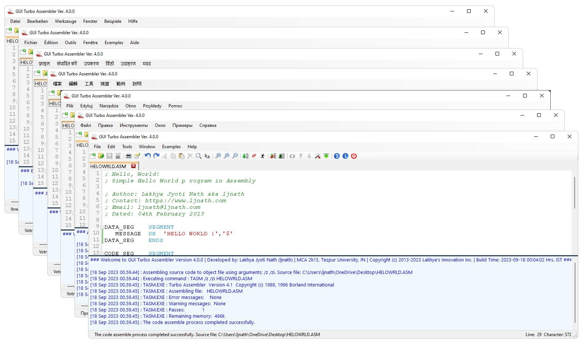

# GUI Turbo Assembler

### Version 4.0.0
Author : Lakhya Jyoti Nath (ljnath) 
First build date : 01st March 2013 @ 17:30 Hrs 
First build completion date : 09th March 2013 @ 15:39:56 Hrs. 
Last release date : 18th September 2023, 00:04:02 Hrs. 
Email : ljnath@ljnath.com 
Website : https://ljnath.com 

## Introduction

GUI Turbo Assembler is an essential Integrated Development Environment for Assembly language.
GUI Turbo Assembler comes integrated with Borland Turbo Assembler and Turbo Linker for assembling and building assembly codes. It is powered by DOSBox for handling Borland Turbo Assembler and Borland Turbo Linker in 64-bit environment.

The IDE is loaded with powerful feature like syntax highlighting, code folding along with the other regular features to work with any assembly source code. It supports compiling and building of assembly codes to windows executable with a single click.

The current version of IDE, boast of tab browsing, thereby allowing users to work with multiple files simultaneously.  With its simple UI and powerful functionalities, it proves to be a great tool and an alternative to the command-line assembler and linker. Version 4.0.0 also offers advanced users the capability to customize the assembly and build processes. For more details, please consult the user guide.

This package comes with Borland Turbo Assembler 4.1, Borland Turbo Linker 7.1 and DOSBox 0.74-3

GUI Turbo Assembler is developed using Microsoft .NET Framework 4.0 and you should have it pre-installed. Microsoft .NET Framework 4.0 can be downloadable from the link given below
http://www.microsoft.com/en-in/download/details.aspx?id=17718

## Contribution

I would highly encounge you to contribute in the locale files. 

Currently localization is supported for French, Russian, Hindi, Polish, German and Chinese-Traditional. These localizations are computer genrated and not 100% accurate and I would kindly request you to contribute and/or correct the locale files. These are plain `JSON` files, which can be edited in any text-editor.

I would love to include the corrected as well as new version in the upcoming public releases.

## Acknowledgement
* [PavelTorgashov]([https://github.com/PavelTorgashov]) - for [FastColoredTextBox]([https://github.com/PavelTorgashov/FastColoredTextBox])
* [DOSBox Team]([https://www.dosbox.com/crew.php]) - for [DOSBox]([https://www.dosbox.com/])

## License
Copyright © 2013-2023 [Lakhya's Innovation Inc.](https://github.com/ljnath/) under the [GPL-3.0 license](https://github.com/ljnath/GuiTurboAssembler/blob/main/LICENSE)

## Give a Star! ⭐️

If you find this repository useful, please give it a star. 
Thanks in advance !

